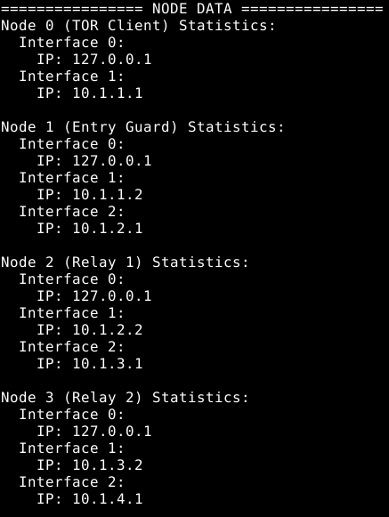
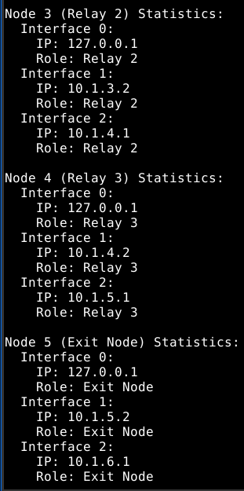

# Simulacije procesa u telekomunikacijskim mrežama - Dizajn i implementacija TOR modela u NS-3 simulatoru

## Opis projekta

U ns-3 simulatoru je potrebno kreirati TOR mrežu i simulirati istu. 

*Ovaj model simulira **TOR (The Onion Router)** mrežu i koristi sedam čvorova:*

- **Klijent** - Započinje slanje paketa (omogućava inicijalizaciju mrežnog saobraćaja),
- **Ulazni čvor** - Predstavlja prvi skok (hop),
- **Tri releja** - Omogućavaju prosljeđivanje mrežnog saobraćaja,
- **Izlazni čvor** - Ovo predstavlja posljednji čvor prije odredišta,
- **Odredište** - Predstavlja posljedni čvor u mreži koji prima pakete i naposljetku ih obrađuje.

Ovaj kod simulira osnovnu TOR mrežu koristeći ns-3 simulator. Omogućeno je kreiranje 7 čvorova, njihovo povezivanje u lanac, dodjeljivanje IP adresa tim čvorovima i postavljanje klijent-server aplikacije. Podaci su šifrirani pomoću AES-256-CBC enkripcijskog algoritma što omogućava OpenSSL-ova EVP biblioteka na svakom skoku. Simulacija prati protok paketa, računa mrežnu statistiku poput kašnjenja i omjera poslanih paketa, te vizualizira mrežu pomoću NetAnim alata (kreira se xml datoteka s nazivom tor-network-visualization.xml na kojoj su prikazani svi čvorovi). Također, ovaj kod omogućuje ispis statistike po čvoru. Simulacija traje deset sekundi.

---

## Funkcionalnost koda

*U nastavku je objašnjen način funkcionisanja TOR mreže implementirane u ns-3 simulatoru:*

1. **Arhitektura simulacije**  
    Simulacija uključuje 7 čvorova: klijent, ulazni čvor (Entry), tri čvora za releje (Relay 1, Relay 2, Relay 3), izlazni čvor (Exit), i krajnji odredišni čvor (Destination). Ova topologija imitira TOR mrežnu strukturu, gdje klijent šalje podatke kroz šifrirane kanale, prolazeći kroz više releja prije nego što stigne do odredišta.  
    1.1 **Mrežna topologija:**  
    - TOR Klijent šalje podatke kroz Entry Guard (ulazni čvor).  
    - Podaci se šifriraju i prolaze kroz releje (Relay 1, Relay 2, Relay 3).  
    - Na kraju, podaci izlaze kroz izlazni čvor i stižu do odredišnog čvora.  
    1.2 **Povezivanje čvorova:**  
    - Svaka veza između čvorova je ostvarena pomoću *PointToPointHelper*-a, koji koristi TCP/IP protokol i P2P (point-to-point) mreže za prijenos podataka.  
    - Svaka veza između čvorova je podešena sa *DataRate*-om (brzina prijenosa podataka) i *Delay*-om (kašnjenjem).  

2. **Enkripcija i sigurnost**  
    Jedan od ključnih aspekata TOR mreže je višeslojna enkripcija, što je implementirano pomoću OpenSSL EVP (Encryption/Decryption API) enkripcijskog algoritma. Kod koristi AES 256-bitnu CBC enkripciju za zaštitu podataka na svakom "skoku" u mreži.  
    2.1 **Ključne funkcije enkripcije:**  
    - **Generisanje ključeva:** Svaka enkripcijska sesija koristi nasumično generisane ključeve pomoću OpenSSL funkcije `RAND_bytes`.  
    - **Šifriranje i dešifrovanje podataka:** Funkcije `EncryptLayer` i `DecryptLayer` omogućavaju višeslojnu enkripciju, gdje podaci prolaze kroz više slojeva šifriranja i dešifrovanja, što je karakteristično za TOR mrežu.  
    2.2 **TOR paket struktura:** Paketi u TOR mreži imaju proširenu strukturu koja omogućava praćenje stanja svakog paketa tokom putovanja kroz mrežu:  
    - `sequenceNumber`: Jedinstveni broj sekvence za svaki paket.  
    - `data`: Podaci u paketu.  
    - `encryptionLayer`: Indikator sloja enkripcije.  
    - `timestamp`: Vrijeme kada je paket kreiran.  
    - `hopCount`: Broj "skokova" kroz mrežu.  
    - `sourceNode` i `destinationNode`: Naziv izvorišnog i odredišnog čvora.  
    - `circuitId`: Identifikator TOR kruga.  
    - `isControl`: Ukazuje na to da li je paket kontrolni paket ili ne.  
    - `encryptionLayers`: Lista slojeva enkripcije na svakom skoku u mreži.  

3. **Simulacija i praćenje**  
    **Početak i kraj simulacije:**  
    - Simulacija traje 10 sekundi, s različitim vremenskim okvirom za početak i završetak aplikacija.  
    3.1 **Praćenje mreže (Flow monitoring):**  
    - Korišćen je *FlowMonitor* za praćenje statistike mrežnog saobraćaja, uključujući podatke o paketu (transmisija, prijem, gubici) i kašnjenju.  
    3.2 **Metrike i statistika:**  
    - **Omjer poslanih i primljenih paketa (Packet delivery ratio):** Pokazuje omjer primljenih i poslanih paketa, što je važan indikator efikasnosti mreže.  
    - **Delay:** Prosječno kašnjenje za primljene pakete.  
    - **Statistika za svaki čvor:** Svaki čvor u mreži ima opis i informacije o svom stanju.  

4. **Simulacija i vizualizacija**  
    **NetAnim:**  
    - Mreža je vizualizovana koristeći *NetAnim*, alat za animaciju mrežne topologije, koji prikazuje mrežnu topologiju i podatke o čvorovima.  
    - Boje čvorova su podešene tako da odražavaju njihove uloge (klijent, relays, izlaz, itd.).  

5. **Dizajn TOR mreže**  
    5.1 **Topologija čvorova:**  
    - Hijerarhija čvorova, kao što su ulazni čvor, releji, i izlazni čvor, simuliraju stvarni TOR dizajn.  
    5.2 **Enkripcija:**  
    - Upotreba višeslojne enkripcije sa ključevima koji se rotiraju na svakom skoku.  
    5.3 **Anonimnost i sigurnost:**  
    - Paketima se dodaju razni podaci (npr., `hopCount`, `timestamp`, `encryptionLayer`) kako bi se simuliralo ponašanje TOR mreže koja pruža anonimnost.

---

## Simulacija

Simulacija se može pokrenuti koristeći sljedeće komande:
```bash
./ns3 run scratch/TOR_model.cc
./ns3 run scratch/TOR_model.cc -- --numPackets=10
./ns3 run scratch/TOR_model.cc -- --initialData="Poruka"
./ns3 run scratch/TOR_model.cc -- --simulationTime=10
./ns3 run scratch/TOR_model.cc -- --dataRate=1000Mbps  
./ns3 run scratch/TOR_model.cc -- --port=9002

```

### Rezultati simulacije

*Prilikom pokretanja simulacije, pojavljuje se detaljan ispis o čvorovima i njihovoj topologiji, podaci o paketima i mrežna statistika.*

<div align="center">
<table>
	<tr>
		<td></td>
      		<td></td>
    	</tr>
    	<tr>
      		<td><p align="center">Slika 1: Podaci o čvorovima: 0, 1, 2 i 3</p></td>
      		<td><p align="center">Slika 2: Podaci o čvorovima: 4, 5 i 6</p></td>
    	</tr>
</table>
</div>

<p align="center">

<br>
Slika 3: Podaci o pozicijama čvorova i prikaz poruke prije i nakon enkripcije
</p>

Za enkripciju je potrebno instalirati OpenSSL biblioteku. To se može uraditi na sljedeći način (na Ubuntu sistemu):

```bash
sudo apt update
sudo apt install libssl-dev
```

Zatim, kreira se backup CMakeLists.txt datoteke i u datoteci se dodaje sljedeće linije:

```
find_package(OpenSSL REQUIRED)
target_link_libraries(scratch ${OPENSSL_LIBRARIES})
```

<p align="center">

<br>
Slika 4: Podaci o zaglavlju paketa
</p>

<p align="center">

<br>
Slika 5: Podaci o mrežnim tokovima
</p>

<p align="center">

<br>
Slika 6: Podaci o ukupnom broju poslanih i primljenih paketa
</p>

### NetAnim

Kod za simulaciju TOR mreže u ns-3 simulatoru omogućava i kreiranje xml datoteke koja se može otvoriti u **NetAnim** softveru koji omogućava prikaz animacije mreže. 

*Na sedmoj slici je prikazana mreža sa svim čvorovima kada se xml datoteka tek otovori u NetAnim-u:*

<p align="center">
<br>
Slika 7: NetAnim - Početak simulacije
</p>

*Na osmoj slici je prikazan završetak simulacije u NetAnim-u:*

<p align="center">
Slika 8: NetAnim - Završetak simulacije
</p>
