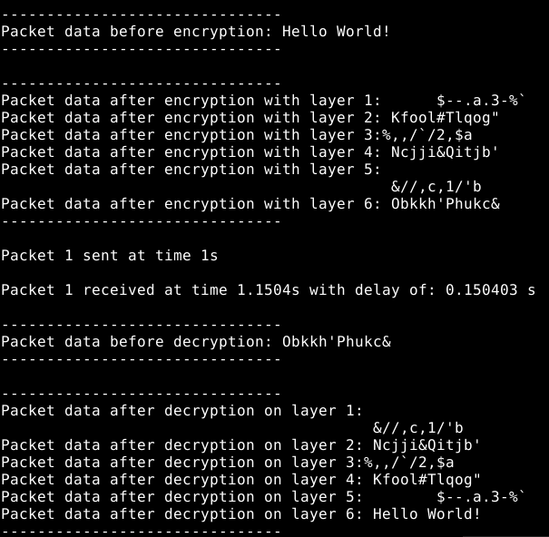
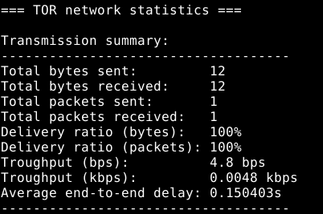

# Simulacije procesa u telekomunikacijskim mrežama - Dizajn i implementacija TOR modela u NS-3 simulatoru

## Opis projekta

Ovaj projekat omogućava sljedeće:

|Funkcionalnost|Opis|
|--------------|----|
|**Slanje paketa**|Šalju se paketi sa porukom "Hello world!". U TOR mrežnoj statistici se može vidjeti ukupan broj poslanih i primljenih bita koji odgovaraju dužini poruke (broj primljenih bita može biti manji od broja poslanih bita zbog kratkog trajanja simulacije ako to korisnik odluči specificirati).| 
|**Enkripcija paketa**|udp-echo-client.cc omogućava višeslojnu enkripciju paketa prije slanja, te se takvi paketi prosljeđuju kroz mrežu. Radi pojednostavljenja simulacije, korištena je XOR (Exclusive OR) enkripcija umjesto mnogo složenije, OpenSSL AES enkripcije. Brojni komentari u objašnjavaju dodane linije kode.|
|**Uklanjanje slojeva enkripcije**|udp-echo-server.cc omogućava uklanjanje slojeva enkripcije tako da se nakon posljednjeg koraka prikaže izvorna poruka bez ikakve enkripcije.|
|**NetAnim simulacija**|Omogućena je NetAnim simulacija kao i generisanje .xml datoteke koja se može koristiti za vizualizaciju simulacije.|
|**Kreiranje .pcap (Packet Capture) datoteka**|Ovo omogućava detaljno snimanje i analizu saobraćaja.|

---

## Upute za pokretanje koda

- Napraviti rezervnu kopiju datoteka udp-echo-client.cc i udp-echo-server.cc ukoliko bude potrebe vratiti prethodne verzije datoteka u budućnosti.
- Kopirati udp-echo-client.cc i udp-echo-server.cc u ~/ns-allinone-3.43/ns-3.43/src/applications/model/ folder, a ove datoteke se nalaze u NS-3 folderu na GitHub-u.
- Kopirati TOR.cc datoteku koja se nalazi u NS-3 folderu na GitHub-u u scratch folder NS-3 simulatora.
- *Pokrenuti kod pomoću sljedeće komande:*

```bash
./ns3 run scratch/TOR
```
Postoje dva parametra koja se mogu specificirati prilikom pokretanja simulacije:

```bash
./ns3 run scratch/TOR -- --simulationTime=10
./ns3 run scratch/TOR -- --maxPackets=10
```

Prvi parametar omogućava specificiranje trajanja simulacije, dok drugi parametar određuje maksimalni broj paketa.

---

## Rezultati simulacije


*Slika 1 - Ispis simulacije.*

Na slici 1 je prikazana string vrijednost koja predstavlja podatke paketa koji se prenose. "Hello world!" biva enkriptovan 6 puta na odredištu, te se dekriptuje 6 puta na odredištu i na kraju se prikazuje prvobitna vrijednost string-a. **udp-echo-client.cc** omogućava kreiranje paketa. Ono što je promijenjeno u tom kodu je to što se kreiraju paketi koji ne šalju vrijednost 0 (šalju "hello world! string", ispisuje se ta vrijednost, paketi se enkriptuju 6 puta i prosljeđuju kroz mrežu). Za ovaj primjer je odabran jedan paket za slanje kroz mrežu.


*Slika 2 - Ispis simulacije.*

*Na slici 2 možemo vidjeti TOR mrežnu statistiku sa svim relevantnim podacima poput:*

- Ukupan broj poslanih bajta,
- Ukupan broj primljenih bajta,
- Ukupan broj poslanih paketa,
- Ukupan broj primljenih paketa,
- Omjer poslanih i primljenih bajta i paketa,
- Propusnost u bps i kbps,
- Prosječno kašnjenje s kraja na kraj.

Modifikacija **udp-echo-server.cc** datoteke je omogućila dekripciju primljenih paketa, dok je u **TOR.cc** datoteci određen broj čvorova, njihov raspored, ispis TOR mrežne statistike, i ostale funckije.  
